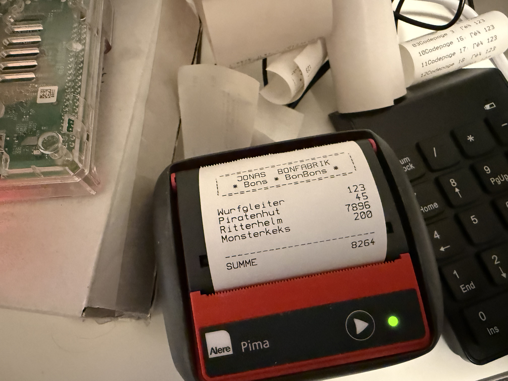

# Bonbonbon



### How it works (keypad + printer)

Type **digits** on the numpad (e.g. `1` `2` `5`) → press **+** to add that line to the receipt. Repeat for more lines. When you’re done, press **Enter** → the receipt is generated (random kid-room items + your amounts) and printed. Simple as the sticker scales at the supermarket.

---

### The story

My son is fascinated by the little carts in the fruit & veg section at Kaufland that print price stickers. So I wanted to build him his own small printer: a USB numpad plus a thermal printer, hooked up to a Raspberry Pi. You “weigh” pretend items (numbers), hit + to add a line, Enter to print — and out comes a fantasy receipt from “Jonas Bonfabrik” with random German words (toys, craft stuff, etc.) and a sum. **Currently German only** (UI and object names).

---

Fantasy receipt generator for a kid “Bonfabrik”: you enter numbers (prices), it prints a receipt with random German kid-room object names (Spielzeug, Bastelsachen, etc.) and a header/sum.

Two modes:

- **Bonbonbon.CLI** — interactive STDIN: type numbers, empty line prints receipt (no hardware).
- **KeypadPrinter** — USB numpad (evdev) + thermal printer: digits → buffer, `+` commits a line, Enter prints receipt. Use on a Raspberry Pi.

**Tested with:** [Cimetech USB numpad](https://amzn.to/4q9S8uY) and [Alere Pima thermal printer](https://cool-web.de/raspberry/raspi-mit-mobilem-thermodrucker-aufruesten-drucken-unterwegs.htm) (GeBE GPT-4352 / 58 mm).

---

## Elixir/Erlang via asdf (Mac + Raspi)

Install [asdf](https://asdf-vm.com/), then Elixir (Erlang is pulled in automatically):

```bash
git clone https://github.com/asdf-vm/asdf.git ~/.asdf --branch v0.14.0
echo '. "$HOME/.asdf/asdf.sh"' >> ~/.zshrc   # or ~/.bashrc
. "$HOME/.asdf/asdf.sh"

asdf plugin add erlang
asdf plugin add elixir
asdf install erlang 27.0   # or latest OTP 27; can take a while on Raspi
asdf install elixir 1.19.0-otp-27
asdf global elixir 1.19.0-otp-27
```

Check: `elixir -v`, `mix -v`.

---

## Run on macOS (testing)

No keyboard/printer hardware needed: everything goes via STDIN/STDOUT.

```bash
git clone <your-repo-url> bonbonbon
cd bonbonbon
mix deps.get
mix compile
```

**Interactive numbers, receipt to terminal:**

```bash
mix run -e "Bonbonbon.CLI.main()"
```

**KeypadPrinter in STDIN mode** (simulate keypad: type digits, `+` to commit a line, Enter to “print”):

```bash
mix run -e "KeypadPrinter.CLI.main()"
```

Receipt is printed to stdout. On Mac there is no `KBD_DEV`/`PRINTER_DEV`, so KeypadPrinter automatically uses STDIN and STDOUT.

---

## Run on Raspberry Pi (testing)

Checkout to `/home/pi/bonbonbon`, build, then run once with keypad + printer.

### 1. Clone and build

```bash
cd /home/pi
git clone <your-repo-url> bonbonbon
cd bonbonbon
mix local.hex --force
mix local.rebar --force
mix deps.get
mix compile
```

### 2. Thermal printer (USB)

Bonbonbon talks to the printer **raw** via the device node (no CUPS needed). Suitable for small thermal printers (e.g. 58 mm, Alere Pima / GeBE GPT-4352 or “KFI Printers USB Printer” in `lsusb`). Inspiration: [Raspi mit mobilem Thermodrucker (cool-web.de)](https://cool-web.de/raspberry/raspi-mit-mobilem-thermodrucker-aufruesten-drucken-unterwegs.htm).

- Plug in the printer. Optional: hold Line Feed while plugging to get a self-test.
- Check device:
  ```bash
  lsusb
  ls -la /dev/usb/lp0
  ```
- Allow user `pi` to write to the printer:
  ```bash
  sudo usermod -aG lp pi
  ```
  Log out and back in (or reboot). Test: `echo 'test' > /dev/usb/lp0` (should not print “Permission denied”).

If you want CUPS and PDF/desktop printing, use the same article to install CUPS and the GeBE driver; Bonbonbon still uses `PRINTER_DEV` for raw output.

### 3. USB keyboard (evdev)

```bash
ls -la /dev/input/by-id/
# Pick the numpad, e.g. ...-event-kbd
sudo usermod -aG input pi
# Log out and back in
```

### 4. Run once (manual test)

```bash
cd /home/pi/bonbonbon
export KBD_DEV="/dev/input/by-id/usb-SIGMACHIP_USB_Keyboard-event-kbd"
export PRINTER_DEV="/dev/usb/lp0"
mix run -e "KeypadPrinter.CLI.main()"
```

Use your real `KBD_DEV` path. Process runs until you stop it (Ctrl+C twice).

---

## Run on Raspi at boot (systemd)

Repo in `/home/pi/bonbonbon`, Elixir via asdf. Service reads env from a file so you don’t put secrets/paths in the unit.

### 1. Env file

Create `/etc/bonbonbon.env`:

```bash
# Linux evdev keyboard device
KBD_DEV=/dev/input/by-id/usb-SIGMACHIP_USB_Keyboard-event-kbd

# USB thermal printer device
PRINTER_DEV=/dev/usb/lp0
```

Adjust paths to your hardware.

### 2. Service unit

Create `/etc/systemd/system/bonbonbon.service`:

```ini
[Unit]
Description=Bonbonbon Keypad Receipt Printer
After=multi-user.target
Wants=multi-user.target

[Service]
Type=simple

User=pi
Group=pi
WorkingDirectory=/home/pi/bonbonbon

EnvironmentFile=/etc/bonbonbon.env
Environment=HOME=/home/pi
Environment=PATH=/home/pi/.asdf/shims:/home/pi/.asdf/bin:/usr/local/sbin:/usr/local/bin:/usr/sbin:/usr/bin:/sbin:/bin

ExecStart=/home/pi/.asdf/shims/mix run -e "KeypadPrinter.CLI.main()"

Restart=always
RestartSec=2

StandardOutput=journal
StandardError=journal
SyslogIdentifier=bonbonbon

[Install]
WantedBy=multi-user.target
```

User `pi` must be in groups `lp` and `input` (see above).

### 3. Enable and start

```bash
sudo systemctl daemon-reload
sudo systemctl enable bonbonbon
sudo systemctl start bonbonbon
```

Check status:

```bash
sudo systemctl status bonbonbon --no-pager
```

Logs: `journalctl -u bonbonbon -f`.

---

## Env reference

| Variable       | Meaning |
|----------------|--------|
| `KBD_DEV`      | Linux evdev keyboard device (e.g. `/dev/input/by-id/...-event-kbd`). If unset, KeypadPrinter uses STDIN. |
| `PRINTER_DEV`  | Thermal printer device (e.g. `/dev/usb/lp0`). If unset, receipt goes to STDOUT. |

---

## More language versions

Currently German only. **Fork the repo** and add translations for UI and object lists — PRs welcome.

## License

MIT — see [LICENSE](LICENSE).
